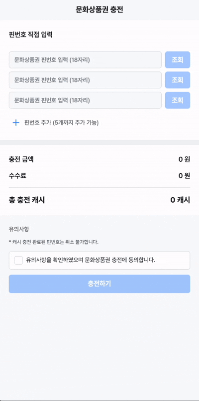

## 👩🏻‍💻 투네이션 과제

투네이션 플랫폼의 캐시 충전 기능을 구현한 **React + TypeScript** 프로젝트입니다.

<br />

| **국내결제 충전**                               | **해외결제 충전**                              | **문화상품권 충전**                              | **문화상품권 에러**                                    |
| ----------------------------------------------- | ---------------------------------------------- | ------------------------------------------------ | ------------------------------------------------------ |
|  |  |  |  |

<br/>
<br/>

## 🚦 실행 방법

```bash
# 의존성 설치
yarn install

# 개발 서버 실행
yarn dev

# 빌드
yarn build
```

<br/>
<br/>

## 🚀 주요 기능

### 💳 캐시 충전

- 금액 입력 필드 (숫자만 가능 + 3자리 콤마 자동 포맷팅)
- 바텀시트를 통한 결제 수단 변경
- 마지막 선택한 결제 수단 자동 저장 및 복원
- 1,000원 이상 선택 시 충전 버튼 활성화.

<br/>

### 🎫 문화상품권 충전

- 13자리 핀번호 입력 및 검증 (숫자만 가능 + 3자리 콤마 자동 포맷팅)
- 중복 핀번호 및 반복 숫자(111...) 에러 처리
- 최대 5개까지 핀번호 추가 가능
- 10% 수수료 자동 계산
- 실시간 총 충전 금액 표시

<br/>

### ✅ 충전 완료

- 충전된 캐시와 총 보유 캐시 표시
- 충전 내역 테이블 형태로 제공

<br/>
<br/>

## 🛠 기술 스택

- **Frontend**: React, TypeScript
- **상태 관리**: React Hook Form, TanStack React Query
- **스타일링**: SCSS, CSS Modules
- **API 모킹**: MSW (Mock Service Worker)
- **빌드 도구**: Vite
- **코드 품질**: ESLint, Prettier, Husky

<br/>
<br/>

## 🎨 주요 컴포넌트

### UI 컴포넌트

- `Carousel`: 캐러셀 내부 아이템이 슬라이드 되며 선택된 아이템이 중앙에 오도록 함
- `Button`: 특정한 크기와 타입의 버튼을 구현하여 해당 프로젝트에서 ui에 규칙성을 부여함
- `Text`: 버튼과 바찬가지로 해당 프로젝트에 사용하는 텍스트 스타일을 한정하여 구현
- `BottomSheet`: 하단에서 올라오는 바텀시트로 외부 영역 클릭 시 닫히고 외부 영역 dim 처리
- `Message`: 토스트 메시지를 제공하여 api 호출 결과를 알 수 있음. 전역적으로 사용할 수 있는 context 구현
- `Icon`: 등록된 svg 파일을 컴포넌트의 name 프롭스로 받아 확장성을 높임
- `Fallback`: Loading, Error, 404를 대응하는 컴포넌트 구현

<br/>
<br/>

## 🧪 MSW 모킹

프로젝트는 MSW를 사용하여 API를 모킹합니다:

- 문화상품권 핀번호 조회 API
- 캐시 충전 API
- 카드 결제 API

개발 모드에서는 자동으로 모킹 서버가 실행됩니다.

<br/>
<br/>

## 📱 주요 페이지

1. **충전하기** (`/account/charge`): 메인 충전 페이지
2. **문화상품권 충전** (`/account/charge/culture`): 문화상품권 핀번호 입력
3. **충전 완료** (`/account/charge/result`): 충전 결과 확인

<br/>
<br/>

## 📝 주요 기능 구현 사항

### 상태 관리

- React Hook Form을 통한 폼 상태 관리
- TanStack React Query를 통한 서버 상태 관리
- Context API를 통한 전역 상태 관리

### 스타일링

- SCSS 믹스인을 활용한 재사용 가능한 스타일
- nesting이 가능한 문법으로 이해하기 쉽고 정확한 구조로 스타일링 함

<br/>
<br/>

## 🎯 개발 중점 사항

- **컴포넌트 재사용성**: 공통 UI 컴포넌트 개발
- **타입 안정성**: TypeScript 활용
- **코드 품질**: ESLint, Prettier를 통한 일관된 코딩 스타일
- **사용자 경험**: 직관적인 UI/UX와 에러 핸들링
- **성능 최적화**: React.lazy를 통한 코드 스플리팅

<br/>
<br/>

## 🔧 코드 품질 관리

- **ESLint**: 코드 규칙 검사
- **Prettier**: 코드 포맷팅
- **Husky**: Git hooks를 통한 pre-commit 검사
- **lint-staged**: 스테이징된 파일만 검사
- **const**: 페이지에서 쓰는 상수를 하나의 파일에 정의

<br/>
<br/>

## 📁 프로젝트 구조

```
src/
├── api/                   # API 관련 파일
│   ├── mocks/             # MSW 핸들러
│   ├── service/           # API 서비스 함수 + api hooks
│   └── type/              # API 타입 정의
├── components/            # 재사용 가능한 컴포넌트
│   ├── page/              # 페이지별 컴포넌트
│   └── ui/                # 공통 UI 컴포넌트
├── constants/             # 상수 정의
├── context/               # React Context
├── pages/                 # 페이지 컴포넌트
├── routes/                # 라우팅 설정
├── scss/                  # SCSS 믹스인 및 스타일
└── utils/                 # 유틸리티 함수
```
